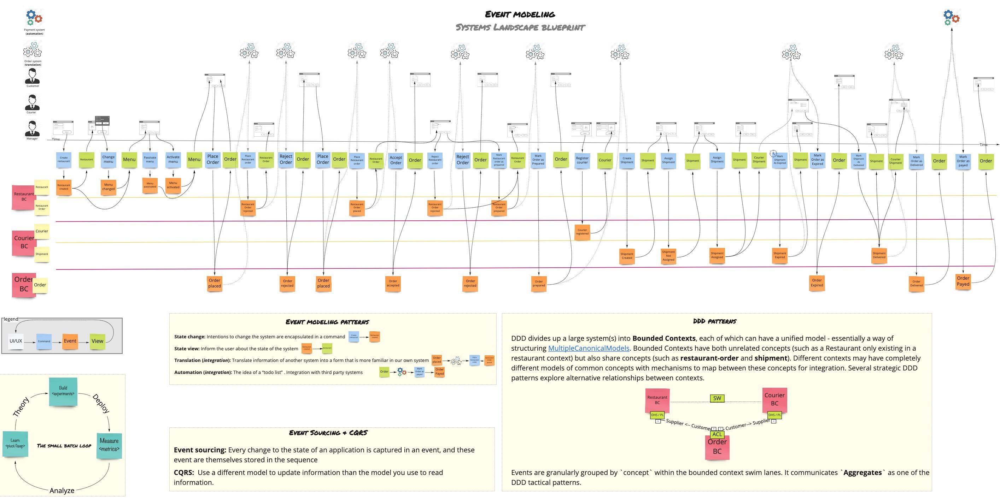
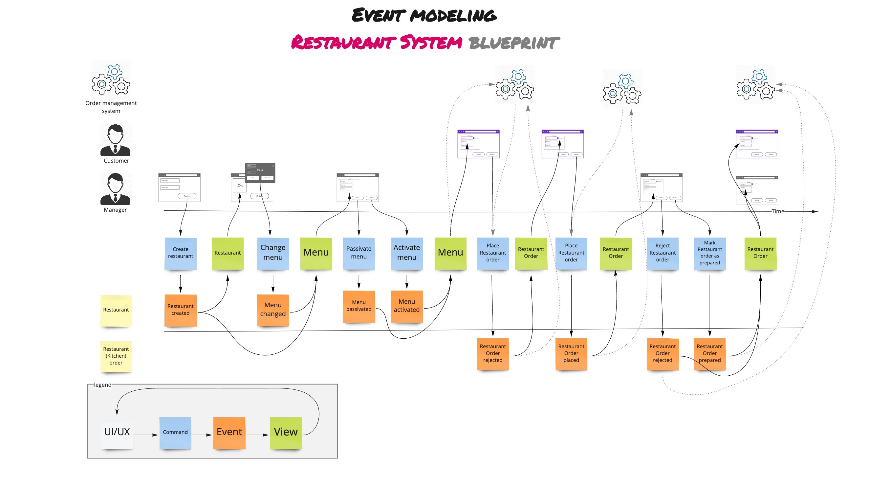

# Restaurant - demo


### Systems Landscape
[Event Modeling](https://eventmodeling.org/) is a method of describing systems using an example of how information has changed within them over time.


The systems landscape consists of three systems [order management](https://github.com/fraktalio/order-demo), [restaurant management](https://github.com/fraktalio/restaurant-demo) and [courier management](https://github.com/fraktalio/courier-demo).

Customers use the web application to place food orders at local restaurants. Application(s) coordinates a restaurant/kitchen order preparation and a network of couriers who deliver the orders.


### **Restaurant Management System**


Specification by example (SBE) is a collaborative approach to defining requirements and business-oriented functional tests for software products based on capturing and illustrating requirements using realistic examples instead of abstract statements.


<table>
    <tr>
        <td><strong>Name:</strong></td>
        <td colspan="3">Restaurant Management</td>
    </tr>
    <tr>
        <td><strong>Description:</strong></td>
        <td colspan="3">Managing restaurant menus and other information including location and opening hours. Managing the preparation of orders at a restaurant kitchen. </td>
    </tr>
    <tr>
        <td><strong>Concepts:</strong></td>
        <td><strong>Architectural patterns:</strong></td>
        <td><strong>Technology:</strong></td>
    </tr>
    <tr>
        <td>
            <ul>
                <li>Domain Driven Design</li>
            </ul>
        </td>
        <td>
            <ul>
                <li>Event Driven Microservices</li>
                <li>Eventsourcing</li>
                <li>CQRS</li>
            </ul>
        </td>
        <td>
            <ul>
                <li>Kotlin</li>
                <li>Axon</li>
                <li>Spring(Boot)</li>
                <li>SQL(Postgres)</li>
                <li>Docker</li>
                <li>Testcontainers</li>
                <li>Kubernetes</li>
                <li>Prometheus</li>
                <li>Grafana</li>
                <li>Jaeger</li>
            </ul>
        </td>
    </tr>
    <tr>
        <td colspan="3"><strong>Service API</strong></td>
    </tr>
     <tr>
        <td>Commands:</td>
        <td>Queries:</td>
        <td>Events published:</td>
    </tr>
    <tr>
        <td>
            <i>gRPC:</i>
            <ul>
                <li>CreateRestaurantCommand</li>
                <li>ActivateRestaurantMenuCommand</li>
                <li>PassivateRestaurantMenuCommand</li>
                <li>PlaceRestaurantOrderCommand</li>
                <li>MarkRestaurantOrderAsPreparedCommand</li>
            </ul>
        </td>
        <td>
            <i>gRPC:</i>
            <ul>
                <li>FindRestaurantQuery</li>
                <li>FindMenuQuery</li>
                <li>FindAllMenusQuery</li>
                <li>FindRestaurantOrderQuery</li>
                <li>FindAllRestaurantsQuery</li>
                <li>FindAllRestaurantOrdersQuery</li>
            </ul>
        </td>
        <td>
            <i>gRPC:</i>
            <ul>
                <li>RestaurantCreatedEvent</li>
                <li>RestaurantMenuActivatedEvent</li>
                <li>RestaurantMenuPassivatedEvent</li>
                <li>RestaurantOrderPlacedEvent</li>
                <li>RestaurantOrderPreparedEvent</li>
                <li>RestaurantOrderRejectedEvent</li>
            </ul>
        </td>
    </tr>
    <tr>
        <td colspan="3"><strong>Domain model:</strong></td>
    </tr>
    <tr>
        <td colspan="3">
            <ul>
                <li>Restaurant</li>
                <li>RestaurantOrder</li>
            </ul>
        </td>
    </tr>
    <tr>
        <td colspan="3"><strong>Dependencies:</strong></td>
    </tr>
    <tr>
        <td colspan="1">Invokes</td>
        <td colspan="2">Subscribes to</td>
    </tr>
    <tr>
        <td colspan="1">
           -
        </td>
        <td colspan="2">
           -
        </td>
    </tr>
</table>

## Development

This project is driven using [maven].


### Run locally 

**Requirements**

>You can [download](https://download.axoniq.io/axonserver/AxonServer.zip) a ZIP file with AxonServer as a standalone JAR. This will also give you the AxonServer CLI and information on how to run and configure the server.
>
>Alternatively, you can run the following command to start AxonServer in a Docker container:
>
>```
>docker run -d --name axonserver -p 8024:8024 -p 8124:8124 axoniq/axonserver
>```

**Build & Test**

```bash
./mvnw clean verify
```
to additionally run integration [testcontainers] tests (docker required):
```bash
./mvnw clean verify -DskipIntegrationTests=false
```
**Run**

```bash
./mvnw spring-boot:run
```

### Run on Kubernetes cluster

**Requirements**

>- [Kubernetes](https://kubernetes.io/). It is included in the Docker on Mac (and Windows) binary so it installed automatically with it. After a successful installation, you need to explicitly enable Kubernetes support. Click the Docker icon in the status bar, go to “Preferences”, and on the “Kubernetes” tab check “Enable Kubernetes”.
>- [Skaffold](https://github.com/GoogleContainerTools/skaffold) is a command line tool that facilitates continuous development for Kubernetes applications.
>- [Kubectl](https://kubernetes.io/docs/tasks/tools/install-kubectl/) allows you to run commands against Kubernetes clusters. You can use kubectl to deploy applications, inspect and manage cluster resources, and view logs

**Continuously deploy**

Use `skaffold dev` to build and deploy your app every time your code changes:
```bash
$ skaffold dev
```
or activate `observability` profile, to enable metrics and tracing with Prometheus, Grafana and Jaeger:
```bash
$ skaffold dev -p observability
```
**Deploy once**

Use `skaffold run` to build and deploy your app once, similar to a CI/CD pipeline:
```bash
$ skaffold run
```
or activate `observability` profile, to enable metrics and tracing with Prometheus, Grafana and Jaeger:
```bash
$ skaffold run -p observability
```

## References and further reading

- [https://microservices.io/book](https://microservices.io/book)
- [https://www.manning.com/books/specification-by-example](https://www.manning.com/books/specification-by-example)
- [https://teamtopologies.com/book](https://teamtopologies.com/book)
- [https://www.oreilly.com/library/view/domain-driven-design-distilled/9780134434964/](https://www.oreilly.com/library/view/domain-driven-design-distilled/9780134434964/)
- [https://ddd-crew.github.io/](https://ddd-crew.github.io/)
- [https://miro.com/app/board/o9J_kqtuB6A=/](https://miro.com/app/board/o9J_kqtuB6A=/)
- [https://eventmodeling.org/](https://eventmodeling.org/)
- [https://docs.axoniq.io/reference-guide/](https://docs.axoniq.io/reference-guide/)
   
---
Created with :heart: by [Fraktalio](https://fraktalio.com/)

[maven]: https://maven.apache.org/
[kotlin]: https://kotlinlang.org/
[spring]: https://spring.io/
[axon]: https://axoniq.io/
[testcontainers]: https://www.testcontainers.org/
